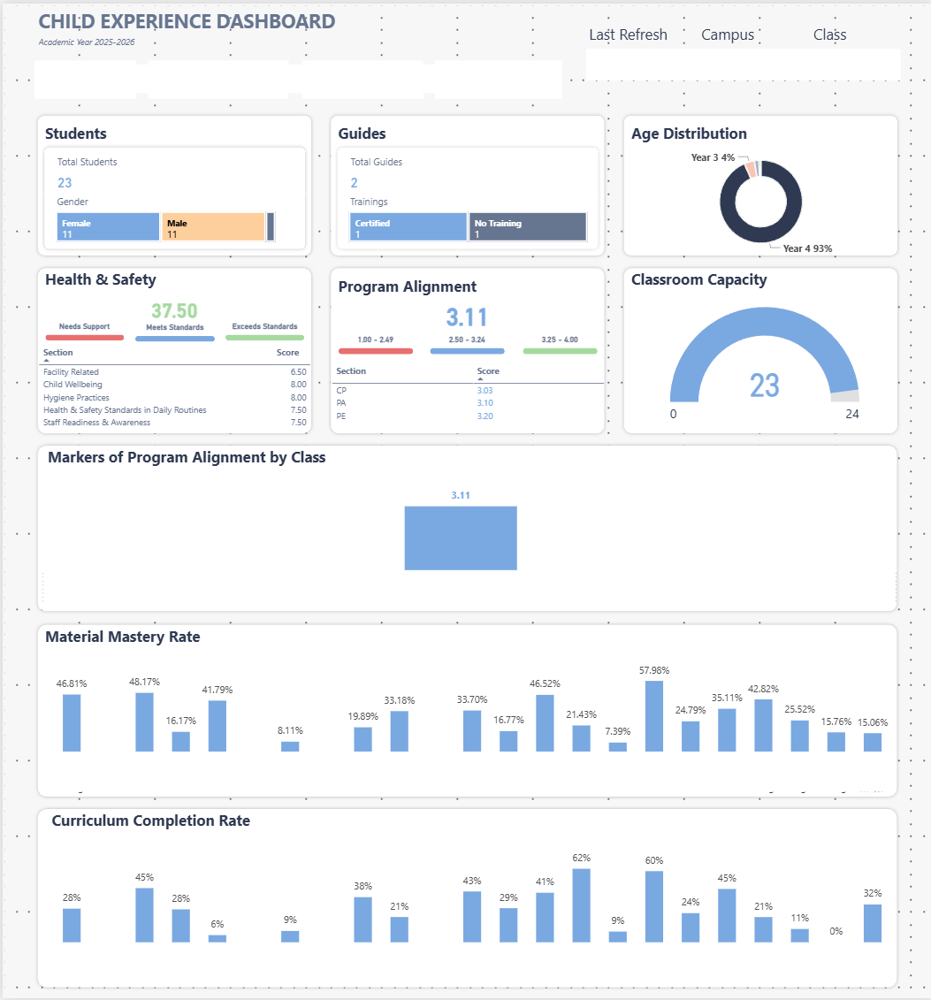

# Child Experience Dashboard

> **More visuals:** View the full set of dashboard screenshots in the [`screenshots`](./screenshots) directory.

## Problem

Teams lacked a consolidated, data-driven view of children’s day-to-day experience across classrooms and programs. Key indicators such as wellbeing, health & safety standards, program alignment, and learning progress were tracked across multiple tools and manual assessments, making it hard to answer questions like:

* How consistently are health and safety standards being met across campuses and classes?
* Where are children thriving, and where is additional support needed?
* How aligned are classroom practices with program expectations?
* Are learning progress and material mastery keeping pace with age-based benchmarks?

The objective was to create a single, trustworthy dashboard that translates operational and observational data into clear, actionable insights for academic and operations teams.

## Data

This project integrates and models data from multiple internal sources, including:

* Sharepoint files from microsoft form surveys
* APIs from LMS websites

To comply with data privacy and confidentiality policies:

* All identifying details (organization, campus, classroom, student) have been anonymized
* All numeric values have been adjusted or randomized
* Dates and academic references have been generalized

The published version preserves the original data model, transformation logic, and analytical intent without exposing sensitive or operational data.

## Results

The final output is a multi-page Power BI dashboard that provides:

* **Student overview**
  Snapshot of total students, age distribution, and classroom capacity to support planning and oversight.

* **Health & safety monitoring**
  Aggregated scoring across facility standards, hygiene practices, staff readiness, and child wellbeing, with clear indicators for areas needing support or exceeding expectations.

* **Program alignment insights**
  Composite and section-level scores showing how classroom practices align with defined program standards.

* **Learning progress visibility**
  Material mastery and curriculum completion rates by class to highlight progress patterns and gaps.

* **Class-level comparison**
  Side-by-side views that allow leaders to identify strengths, inconsistencies, and opportunities for coaching or intervention.

* **Self-service exploration**
  Interactive filters by campus and class, designed for non-technical users to explore insights independently.

This dashboard replaced fragmented reports with a shared, consistent view of child experience, enabling more focused conversations around quality, support, and continuous improvement.

## Tools & Techniques

* Power BI
* Power Query (data cleaning, transformation, normalization)
* DAX (scoring logic, aggregations, and time-based measures)
* Dimensional modeling (conformed campus, class, and date dimensions)

## Notes on Confidentiality

This repository is intended purely as a portfolio case study.

All screenshots, labels, metrics, and examples have been anonymized or modified to protect sensitive information while demonstrating analytical thinking, data modeling, and dashboard design skills.
